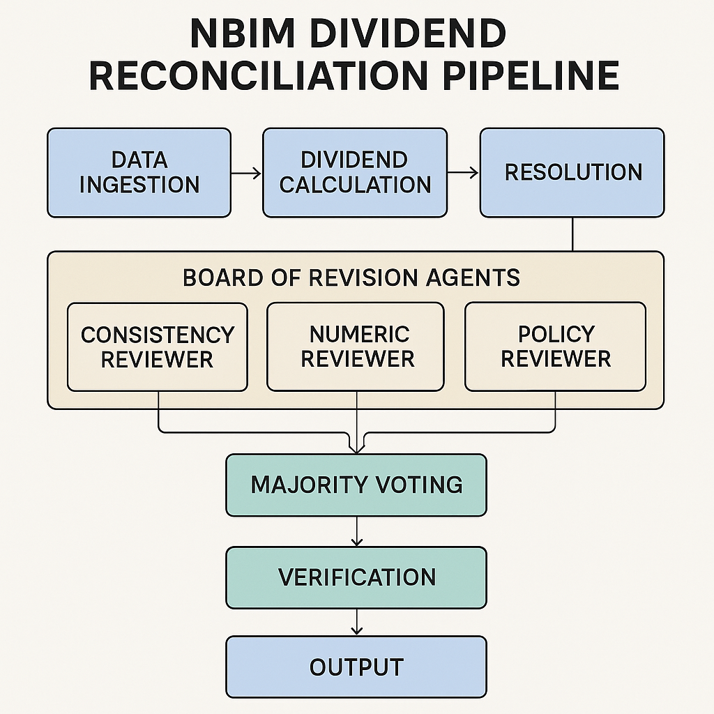

# NBIM Dividend Case

I apologies for the scattered notes but I am writing this on a train after having moved apartment today :) 
I intend to have a more clear presentation for Thursday.

## 1. Key Questions

- How can LLMs classify and prioritize reconciliation breaks?
  - We detect mismatches across amount, date, tax, and missing records, then assign a severity/priority score (1–10) with operational urgency. Outputs include per-row issues, impact, and recommended actions to drive workflows.

- What types of intelligent agents could automate the entire workflow?
  - Break Detection Agent: finds discrepancies and candidate matches.
  - Root Cause Analysis Agent: explains likely causes and data-quality issues.
  - Priority Classification Agent: scores materiality and urgency.
  - Team Resolution Orchestrator: proposes concrete fixes to NBIM/Custody data.
  - Majority Review Board: three-reviewer gate that approves/blocks resolutions.

- What safeguards are needed for autonomous financial operations?
  - Majority-vote review before any remediation downloads are enabled.
  - I would also want it to operate similar to a GitHub bot generating a PR in GitHub. This so that in the case of a discovered error a human can take a look at the agents conclusions. Either giving a "thumbs up" and approve the changes or turn down the suggestions in the worst case of the agents hallucinating.

## 2. Prototype explanation

- Integrated with Anthropic API (Claude 3.5)

- Classification and reconciliation logic
  - Uses `DataIngestion` for normalized NBIM/Custody frames.
  - `ConsolidatedRowAnalysisAgent` produces per-row analysis + portfolio summary.
  - `TeamResolutionOrchestrator` proposes fixes; `MajorityReviewBoard` approves or sends back revision feedback.
  - FastAPI endpoints: `/api/analyze`, `/api/resolve`, and gated `/api/download-fixed/{nbim|custody}`.

- Documentation of prompts and approach
  - Prompt categories live in [backend/prompts.json](backend/prompts.json) and are loaded via `PromptConfig` in [backend/config.py](backend/config.py).
  - Reports emitted to `backend/reports/` in both JSON and Markdown for traceability.

## 3. Architecture Vision

Graph generated by Perplexity (or Dal-e) of the agent architecture

Asset link: [Perplexity S3](https://user-gen-media-assets.s3.amazonaws.com/gpt4o_images/f3b71157-10c4-47ba-9b67-35d1ee0efadb.png)

- Design for an agent-based system
  - Modular agents: detection → explanation → prioritization → resolution → review.
  - Orchestration via [backend/dividend_reconciliation_orchestrator.py](backend/dividend_reconciliation_orchestrator.py) and API layer in [backend/api_server.py](backend/api_server.py).
  - Frontend (React/Vite) consumes `/api/analyze` for UX; downloads are exposed only after review approval.
  - Clear separation of concerns enables swapping LLMs, adding heuristics, or integrating rule-based checks.

## 4. Analysis & Recommendations

- Innovative use cases you've identified
  - Auto-triage queue for operations by priority and impact.
  - Portfolio-level heatmaps of systemic issues (by market, custodian, tax regime).
  - “What-if” simulations for policy adjustments (e.g., rounding/tax rules).
  - Continuous data-quality monitoring with drift alerts.

- Risk assessment and mitigation strategies
  - Human-in-the-loop via majority review; block remediation unless approved.

  ## 5. Other possible applications of the agent architecture
  I think this architecture in broad terms could be used for most "tedious" tasks that depend on manual review and fixes.
  The core aspect of my architecture are the agents in the reviewer team. This is a way of mitigating sensor risks in airplanes today thus the idea.
  So instead of having humans manualy confirming that a sensor is correct they have duplicate sensors measuring the same component and vote, this to prevent malfunctions.

  The closest related application I came to think of is trading settlement data. Especially how pricing is done, since I expect the fund knows how many shares they trade.
  But an example could be that a bank like Citi could calculate a trade cost of say a 100k USD based on a bunch of factors. If we could keep track of the value inputs and maths behind those costs a similar agent system could monitor for faulty calculations and potentialy save the fund money.